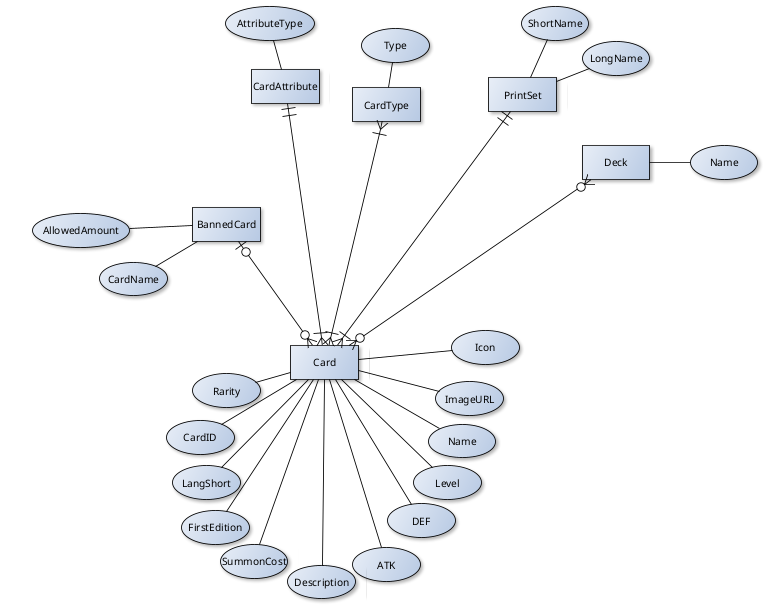

# YuGiOh Deck Builder
## Team Members
- **Elias Pühringer** (Project Leader)
- **Diana Schweighofer**
- **Christoph Moosbrugger**
## Description
A basic DB that saves cards from the trading card game **"YuGiOh"** and can save Decks made out of those cards

### ERD

### Entities
**Card**:  
- CardID
    - ID given in PrintSet
- Rarity
    - Rarity of card in PrintSet
- LangShort
    - Language Abbriviation
- FirstEdition
    - Is the card a first edition card
- SummonCost
    - What are the costs to summon the card?
- Description
    - Description of card/Effect of card
- ATK
    - Attack of the card
- DEF
    - Defense of the card
- Level
    - Level of card in Stars
- Name
- ImageURL
    - URL to an image of the card  
- Icon
    - Icon of the card (Is it a continuous spell card/counter trap card, ...)
  
**PrintSet**:  
- ShortName
    - Short name given by Konami to the printset (e.g. MP22)
- LongName
    - Full name of the Print Set (e.g. 2022 Tin of the Pharaoh's Gods)  
  
**Deck**:  
- Name
    - Name given to deck by User  
  
**CardType**:  
- Type
    - What is the card (Does it have an Effect? -> Effect Type, Is it a Monster -> Monster Type (e.g. Zombie), Is it both -> Monster/Effect Card (e.g. Zombie/Effect))  
  
**CardAttribute**:  
- AttributeType
    - What is the Attribute of the card (e.g. Dark, Light, Divine...)
  
**BannedCard**
- AllowedAmount
    - How many of the card is allowed in a deck (0, 1 or 2 (if the card isn't banned it is always 3))
- CardName
    - Name of the banned card (doesn't go after PrintSet but CardName)
  
**BanList**:  
- Date
    - When was the BanList released

### Entity Relations
- Card manyToMany Deck (One card can be part of many decks and a deck can have multiple of one card)  
- Card manyToOne PrintSet (In which Set was the card printed)  
- Card manyToMany CardType (A card can have multiple types and a type can be assigned to multiple cards)  
- Card manyToOne (A card can only have 1 Attribute and multiple cards can have the same attribute)  
- Card manyToOne BannedCard (A card with a given name is banned)  
- BannedCard manyToMany BanList (Multiple BannedCards are in a Banlist, and banned Cards could also have been banned in older BanLists)  
