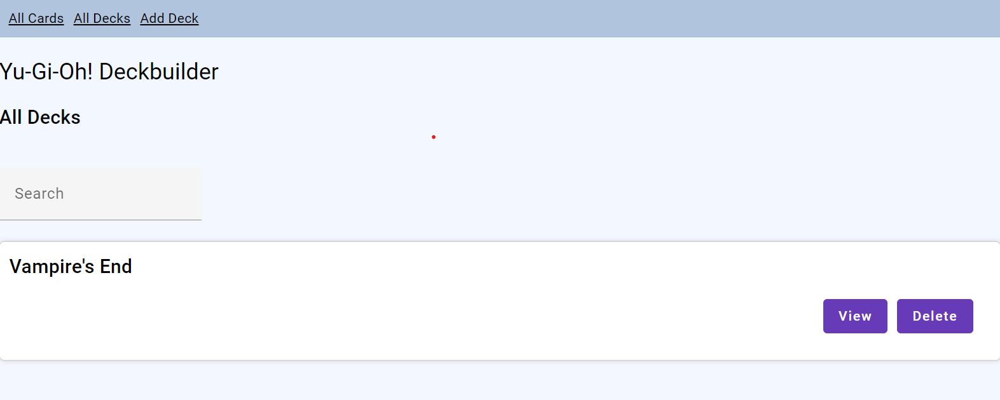

# Yu-Gi-Oh! Deckbuilder

## Gruppe

- Gruppenleiter, Backend: Pühringer Elias
- Backend: Moosbrugger Christoph
- Frontend: Schweighofer Diana

## Technologien

- JPA Backend mit Quarkus, Hibernate ORM, Resteasy- Jackson
- Angular Frontend

## User Interface

- Auflistung aller vorhandenen Karten mit Filterfunktionen nach:
  - Name (nicht case-sensitive)
  - SummonType
  - Rarity

- Auflistung aller Decks
  - Möglichkeit, Deck zu löschen
  - Möglichkeit, alle Karten im Deck einzusehen
    - Weiterleitung auf andere Seite für detaillierte Deckansicht

- Detaillierte Deckansicht:
  - Auflistung aller, im Deck enthaltener Karten
  - Bearbeitungsoption

- Hinzufügen eines neuen Decks
  - Auswählen von Karten und deren Anzahl
  - Auswählen des Decknamens

## Error Handling

- Ausgabe einer Nachricht, wenn keine Karten gefunden wurden
- Es können keine Negativwerte für Kartenanzahlen angegeben werden
